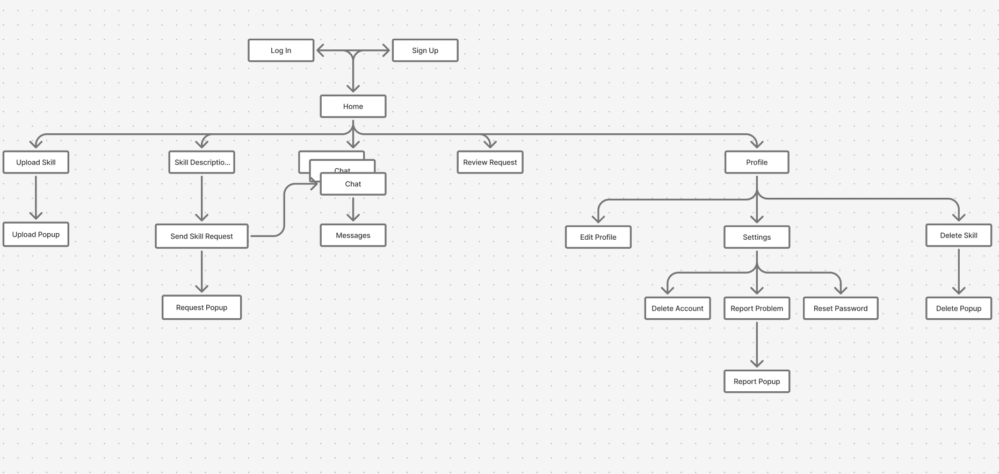
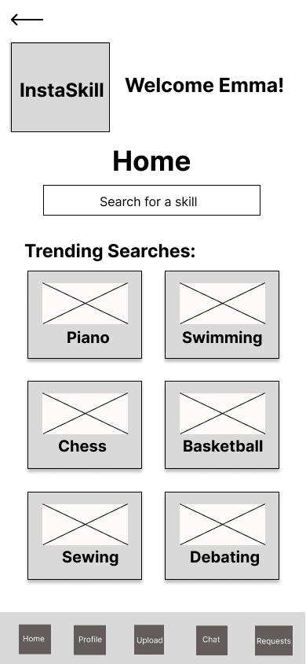
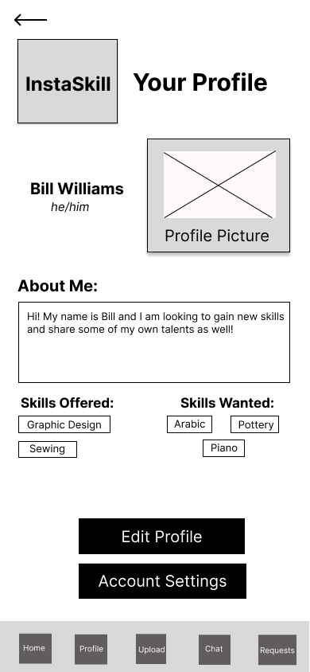
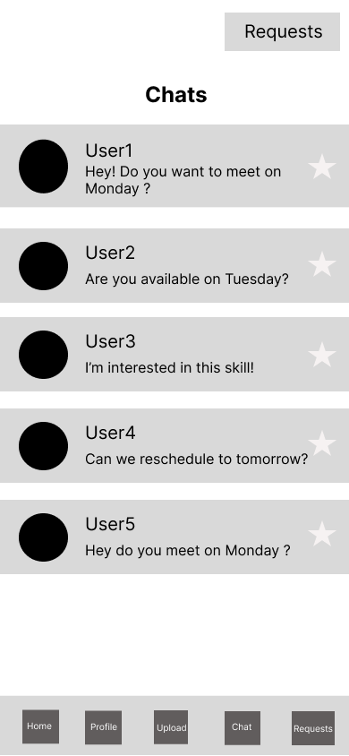
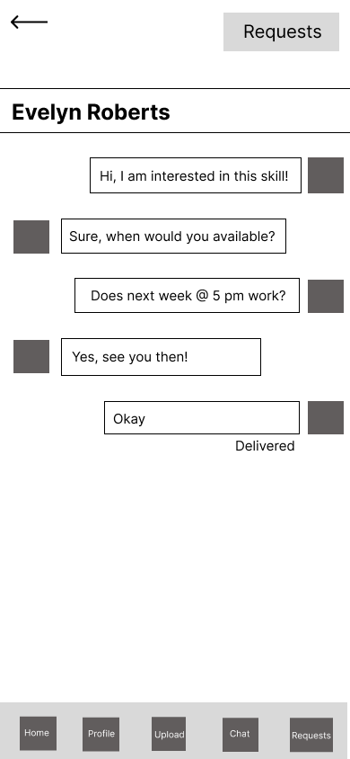
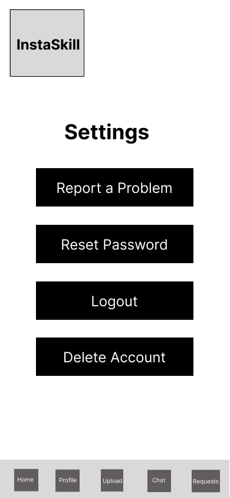

# UX Design

## App Map
The following diagram shows the overall structure and navigation flow between the main screens of the app.

---

## Wireframes

### 1. Log In
This screen allows existing users to enter their credentials and access the app. It contains fields for username and passwor. It also contains 2 links. First is to reset the password if needed, and the second redirects the user to the Sign Up page if it is their first time using the application.

---

### 2. Sign Up
New users can register by providing their basic details such as username and password. Once registered, they are redirected to the Home screen.

---

### 3. Home
The home screen features a “Search for Skill” bar where the user can search for their desired skill. It also display the skills that are currently trending. Whenever th user clicks on a skill, they are redirected to view its detailed description. A fixed bottom navigation bar (Chat, Requests, Home, Upload, and Profile) appears on all screens for quick access.

---

### 4. Skill Description
It displays detailed information about a selected skill including the name, description, and an image/video of demonstration. Users can send a request from this page if interested.

---

### 5. Upload Skill
It allows users to add a new skill to share with others. The screen includes input fields for skill name, description, an image/video and an upload button.

---

### 6. Upload Popup
A confirmation popup that appears after submitting a new skill. It shows a success message or indicates upload progress.

---

### 7. Profile
Shows the user’s profile, including their photo, username, an about me section, skills they offer, and skills they wish to learn. It contains an Edit Profile button if user wishes to modify their profile and an Account Settings button.

---

### 8. Edit Profile
Enables the user to update their personal information, profile picture and add/remove skills. Includes a save button.

---

### 9. Chat
The chat feature displays a list of ongoing conversations. Users can select a chat to view or send new messages.

---

### 10. Messages
This screen represents the chat conversation view, showing sent and received messages between users in real time.

---

### 11. Requests
Shows all incoming and outgoing skill exchange requests. Users can accept or reject pending requests.

---

### 12. Send Request
Appears when a user wants to request a skill from another user. Includes message input and a send button.

---

### 13. Request Popup
Appears when a user sends a skill swap request. Confirms that the request was successfully sent.

---

### 14. Delete Skill
Lets users remove one of their uploaded skills from the platform.

---

### 15. Delete Popup
A confirmation message that appears when deletes a skill.

---

### 16. Settings
Contains controls for adjusting app preferences such as reset password, report a problem, logout and delete account.

---

### 17. Report Problem
Allows users to describe an issue they faced in the app, such as a bug. Includes a text box and submit button.

---

### 18. Report Popup
Displays when a user reports a problem. It confirms submission of the report.

---

### 19. Delete Account
Provides an option for users to permanently delete their account, with a warning message about data loss.

---

### 20. Reset Password
Allows users to reset their account password.

---

